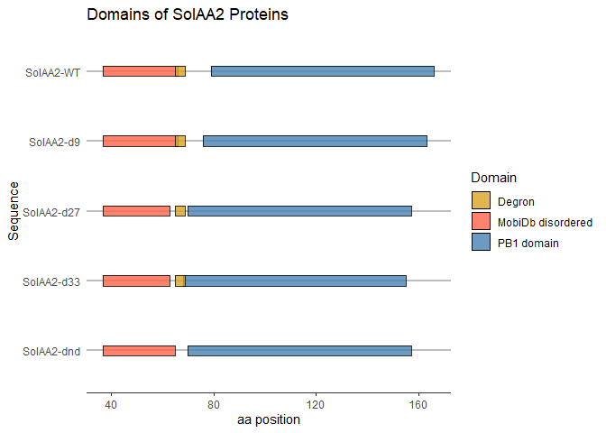

# Summary of IAA proteins
Dr. Kristina Gagalova

- [Load the protein dataset](#load-the-protein-dataset)

## Load the protein dataset

``` r
# Required packages
library(ggplot2)
library(gggenes)
library(dplyr)
```


    Attaching package: 'dplyr'

    The following objects are masked from 'package:stats':

        filter, lag

    The following objects are masked from 'package:base':

        intersect, setdiff, setequal, union

``` r
library(readr)

# Load data
ipr <- read_tsv("../data/pfam/SoIAA2_iprscan5-R20250414-145623-0512-70242364-p1m.tsv", comment = "#", col_names = FALSE)
```

    Rows: 43 Columns: 15

    ── Column specification ────────────────────────────────────────────────────────
    Delimiter: "\t"
    chr (11): X1, X2, X4, X5, X6, X9, X11, X12, X13, X14, X15
    dbl  (3): X3, X7, X8
    lgl  (1): X10

    ℹ Use `spec()` to retrieve the full column specification for this data.
    ℹ Specify the column types or set `show_col_types = FALSE` to quiet this message.

``` r
# Rename relevant columns for clarity
colnames(ipr)[c(1, 4, 6, 7, 8)] <- c("protein", "source", "domain", "start", "end")

# Define sequence lengths manually
seq_lengths <- tibble::tibble(
  protein = c("SoIAA2-WT", "SoIAA2-d9", "SoIAA2-d27", "SoIAA2-d33", "SoIAA2-dnd"),
  seq_end = c(172, 169, 163, 161, 163)
)

# Extract PB1 domain entries from ProSiteProfiles
pb1 <- ipr %>%
  filter(source == "ProSiteProfiles" & grepl("PB1", domain, ignore.case = TRUE)) %>%
  select(protein, start, end, domain) %>%
  mutate(feature = "PB1 domain")

# Extract longest disorder region per protein from MobiDBLite
disorder <- ipr %>%
  filter(source == "MobiDBLite") %>%
  group_by(protein) %>%
  mutate(length = end - start) %>%
  filter(length == max(length)) %>%
  ungroup() %>%
  select(protein, start, end, domain) %>%
  mutate(feature = "MobiDb disordered")

# Combine features and trim to sequence length
features <- bind_rows(pb1, disorder) %>%
  left_join(seq_lengths, by = "protein") %>%
  mutate(end = pmin(end, seq_end)) # prevent domain arrows from extending past actual sequence

# Add degron manually
degron <- tibble::tibble(
  protein = c("SoIAA2-WT", "SoIAA2-d9", "SoIAA2-d27", "SoIAA2-d33"),
  start = 65,
  end = 69,
  domain = "Degron",
  feature = "Degron"
)

# Combine all features and trim at true protein end
features <- bind_rows(pb1, disorder, degron) %>%
  left_join(seq_lengths, by = "protein") %>%
  mutate(end = pmin(end, seq_end))  # Ensure feature doesn't exceed protein length


# Order sequences
features$protein <- factor(features$protein, levels = c("SoIAA2-dnd", "SoIAA2-d33", "SoIAA2-d27", "SoIAA2-d9", "SoIAA2-WT"))


# Plot
ggplot(features, aes(xmin = start, xmax = end, y = protein, fill = feature)) +
  geom_gene_arrow(arrowhead_width = ggplot2::unit(0, "mm"),
    arrowhead_height = ggplot2::unit(3, "mm"),
    alpha = 0.8) +
  theme_genes() +
  labs(
    title = "Domains of SoIAA2 Proteins",
    x = "aa position",
    y = "Sequence",
    fill = "Domain"
  ) +
  scale_fill_manual(values = c(
    "PB1 domain" = "steelblue",
    "MobiDb disordered" = "tomato",
    "Degron" = "goldenrod"
  ))
```


