# Summary of IAA proteins
Dr. Kristina Gagalova

- [Load the protein dataset](#load-the-protein-dataset)
- [Calculate summary of proteins](#calculate-summary-of-proteins)

## Load the protein dataset

``` r
library(seqinr)
library(idpr)

# Read sequences from FASTA file
sequences <- read.fasta(file = "../data/sequences/S.orientale-muts.fasta", seqtype = "AA", as.string = TRUE, set.attributes = FALSE)
```

    Warning in readLines(file): incomplete final line found on
    '../data/sequences/S.orientale-muts.fasta'

## Calculate summary of proteins

``` r
for (i in seq_along(sequences)) {
      seq_name <- names(sequences)[i]
      seq_string <- sequences[[i]]
      
      cat("\n=====================================\n")
      cat("Processing sequence:", seq_name, "\n")
      cat("=====================================\n\n")
      
      # Check valid input
      if (!is.character(seq_string) || length(seq_string) != 1) {
      warning(paste("Skipping", seq_name, "- invalid sequence format"))
        next
      }
      
      # Run summaries
      cat("=== IDProfile Summary ===\n")
      profile <- idprofile(seq_string, proteinName=seq_name)
      print(profile[1:5])
      
    }
```


    =====================================
    Processing sequence: SoIAA2-WT 
    =====================================

    === IDProfile Summary ===
    [[1]]


    [[2]]

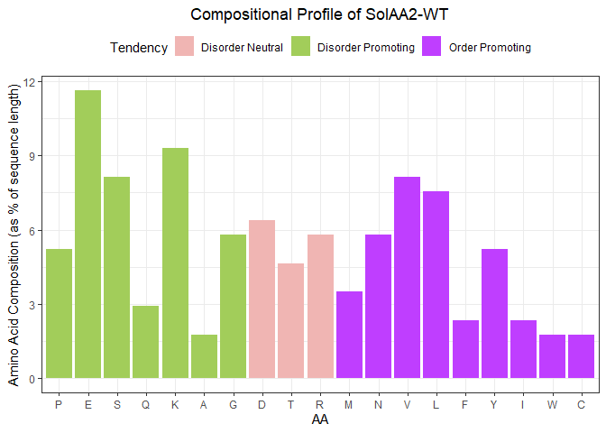


    [[3]]

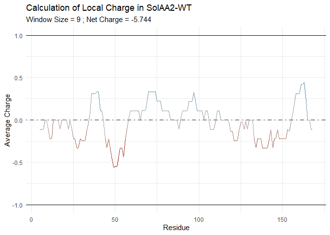


    [[4]]

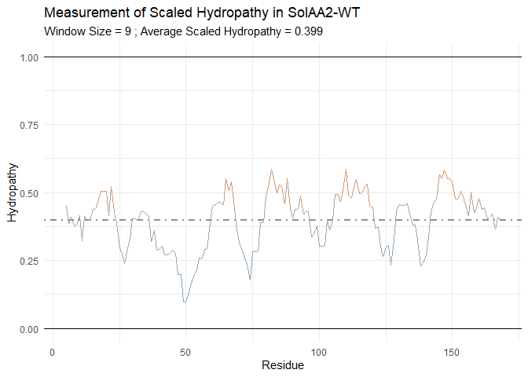


    [[5]]

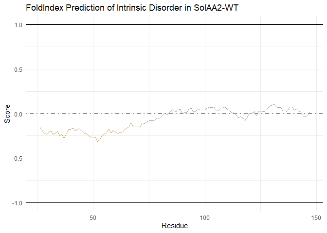


    =====================================
    Processing sequence: SoIAA2-d9 
    =====================================

    === IDProfile Summary ===
    [[1]]


    [[2]]

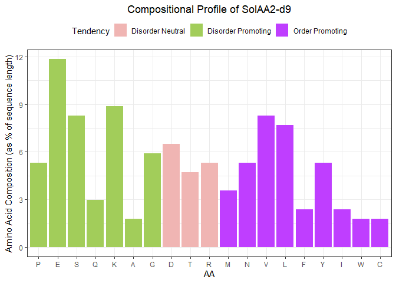


    [[3]]

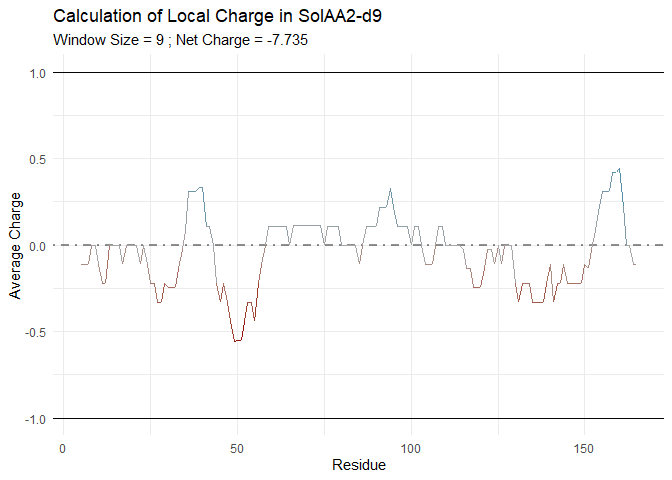


    [[4]]

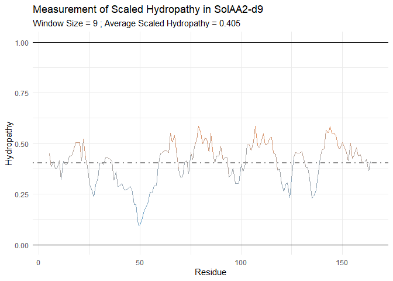


    [[5]]

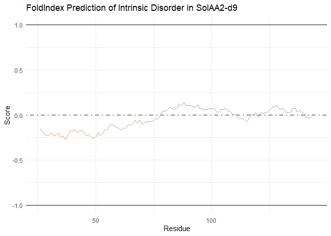


    =====================================
    Processing sequence: SoIAA2-d27 
    =====================================

    === IDProfile Summary ===
    [[1]]


    [[2]]

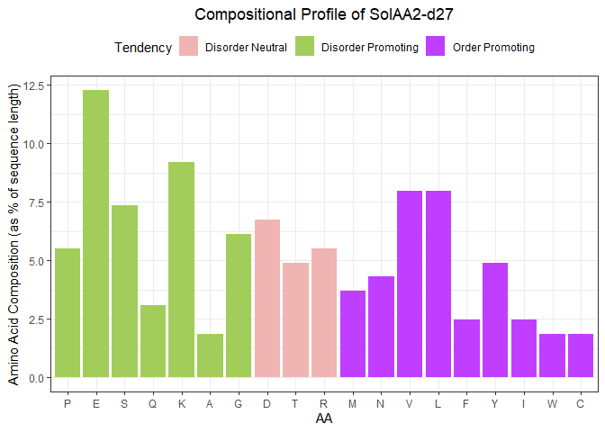


    [[3]]

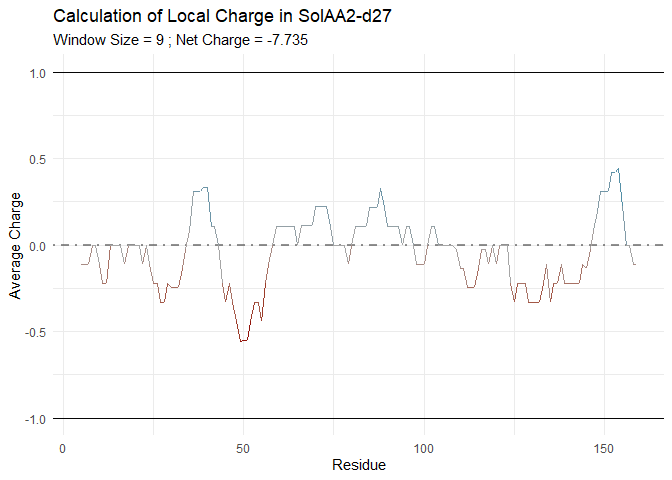


    [[4]]

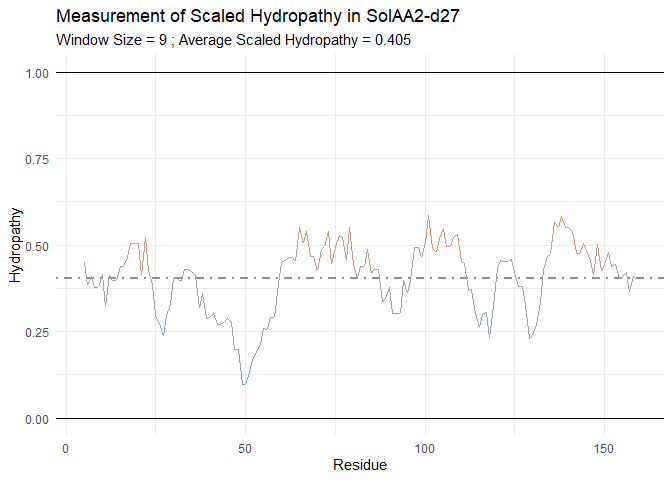


    [[5]]

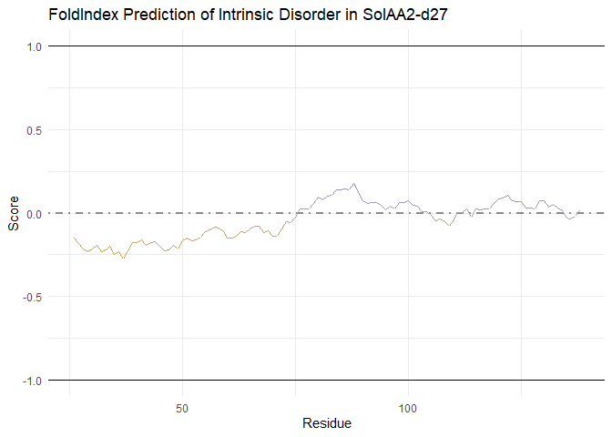


    =====================================
    Processing sequence: SoIAA2-d33 
    =====================================

    === IDProfile Summary ===
    [[1]]

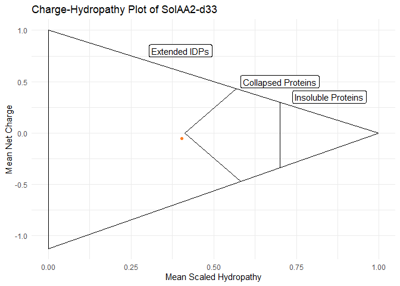


    [[2]]

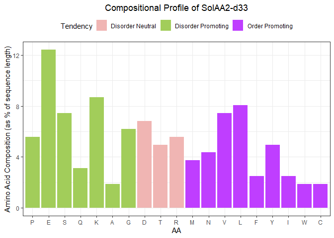


    [[3]]

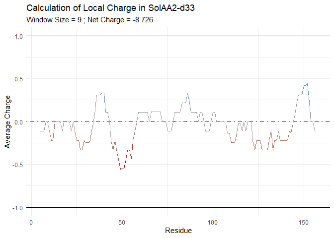


    [[4]]

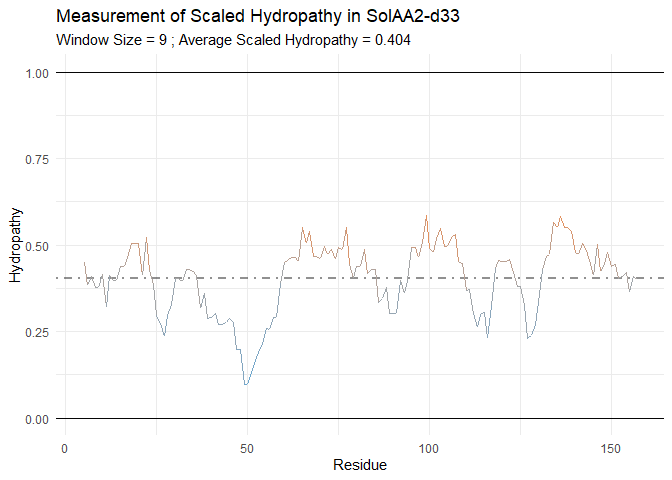


    [[5]]


    =====================================
    Processing sequence: SoIAA2-dnd 
    =====================================

    === IDProfile Summary ===
    [[1]]


    [[2]]

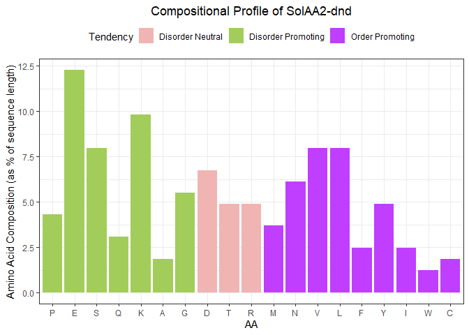


    [[3]]

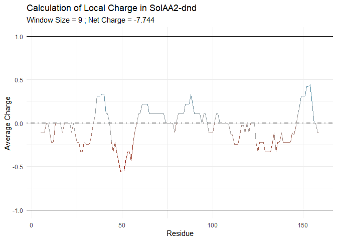


    [[4]]

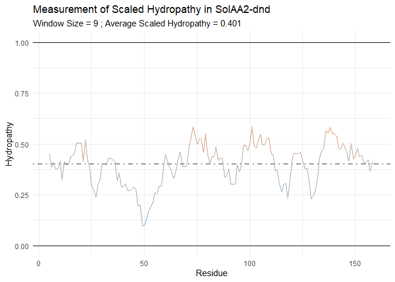


    [[5]]


